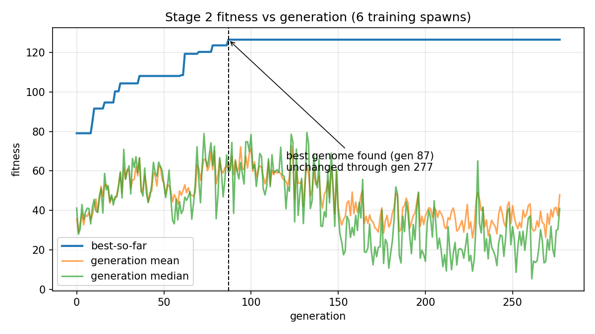
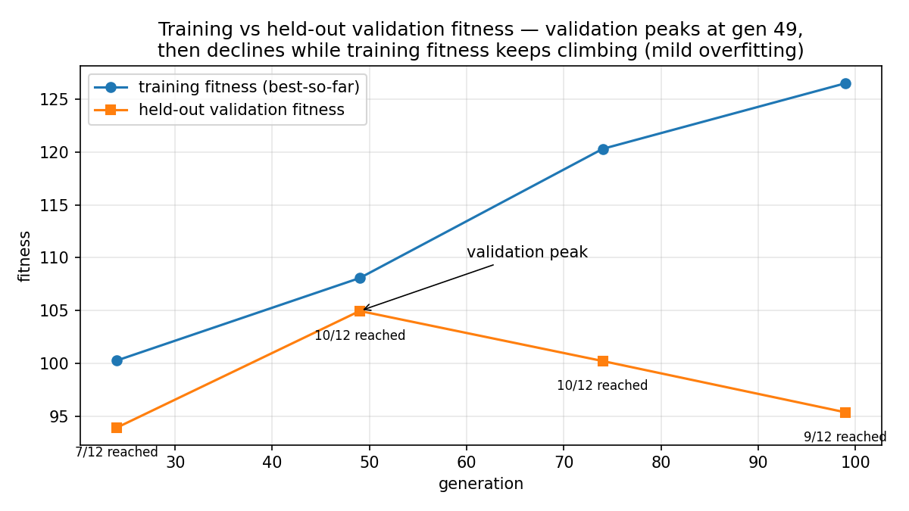

# Evolving a Quadruped Gait and Morphology for Box-Pushing

A memetic genetic algorithm that jointly evolves a quadruped's **CPG gait
parameters**, **one morphology parameter (leg length)**, and **low-level
controller steering gains** to solve a "push the box to the goal" task in
PyBullet. Everything — gait, body proportion, and navigation behavior — is
encoded in a single 24-gene genome.

This repository is **Stage 1 of a master's research plan on morphology–behavior
co-design**. It extends the lineage of virtual-creature evolution established by
Sims (1994) — but where Sims evolved creatures in a carefully staged set of
virtual-physics worlds, this project is motivated by a concrete failure mode of
plain GAs observed in the first version of this pipeline (v1): **premature
convergence to a single strategy**. Stage 1 validates the core co-design
mechanism in a single-agent 3D physics setting; the planned next stage applies
quality-diversity methods (e.g. MAP-Elites) to the same genome space to prevent
that single-strategy convergence. The overfitting evidence below is precisely
what motivates it.

## Task

An 8-DOF sagittal quadruped (torso + 4 legs × {hip, knee}) spawns at the
origin. A box spawns somewhere in an annulus 1–3 m away. The robot must walk to
the box, **approach it from the side opposite the goal**, align, and push it
into a goal disc of radius 0.5 m centered at (3, 0). Episodes last at most 90 s
of simulated time; physics at 240 Hz, controller at 60 Hz.

## Method

### Genome (24 genes, normalized to [0, 1])

| Block | Genes | What it controls |
|---|---|---|
| Per leg (×4) | hip amp/phase, knee amp/phase | CPG gait shape per leg |
| Global | frequency, duty, leg_length | gait timing + **morphology** |
| Control | steer_gain, turn_threshold, turn_drive, stage_offset, push_lookahead | navigation/steering gains used by the controller |

Phases are circular genes (mutation wraps rather than clipping); everything
else is clamped.

### Two-stage training

1. **Stage 1 — locomotion pretraining** (`pretrain_locomotion.py`): evolves
   walk / spin-both-ways / arc primitives against a scripted command sequence
   that includes the *transitions* between primitives. With random genomes
   almost every robot falls over, so the push-task fitness is flat near zero
   and selection has nothing to work with. Top genomes become seeds.
   The v1 seed gait (its generation-346 best) anchors this stage; the archived
   top seed walks at ~0.5 m/s and spins ~32°/s in both directions, completing
   the full script upright (locomotion fitness 1.364).
2. **Stage 2 — push task** (`main.py`): evolves the full task with the v1
   seed-derived population.

### The memetic GA

- Tournament selection (size 3), elitism (2), Gaussian mutation with
  **adaptive sigma** (shrinks on improvement, grows on stagnation).
- **Block-aware crossover**: whole leg blocks and the global block are
  inherited intact; only the (largely independent) control block crosses
  per-gene. Per-gene crossover broke coordinated amp/phase pairs in v1.
- Every 5 generations, a **(1+λ) local search** hill-climbs around the current
  best with 6 small-sigma candidates.
- Every spawn's score is computed independently; the aggregate is
  `0.75·mean + 0.25·min` over spawns, so a genome cannot win by solving easy
  spawns and ignoring the hard one.
- Training spawns: 6 positions stratified in angle around the robot start
  (v1 used 3 uniform-random spawns; the draw contained one trivial and two
  unsolvable cases, so fitness measured luck). Validation: v1's 3 legacy
  spawns plus 9 seeded random spawns the GA never sees.

### Fitness

Reached: `100 + 50·(1 − t/T_max)`. Not reached:
`80·clip(box_progress, −0.25, 1) + 10·approach_progress − 10·flip`, always
< 100. Box progress is normalized by `(d0 − goal_radius)`, so near and far
spawns are worth the same. Watchdogs (flip, stall, no-progress) only stop an
episode early — they never overwrite the metrics fitness is computed from.

## Key engineering fixes over v1

1. **Fitness gave zero gradient.** v1 scored exactly 0 for any episode that did
   not move the box goalward, and its progress watchdog overwrote
   `initial_dist`, corrupting the score; its 20 s episode cap killed every far
   spawn before the robot could arrive. Fixed as above.
2. **The controller routed through the box.** v1's ORBIT waypointed to a point
   0.5 m behind the box — a line that often crosses the box and shoves it the
   wrong way — and v1's PUSH steered toward the robot's own position, so it
   never pushed goalward except by accident. The new controller stages at
   `box − u·stage_offset`, routes around the box on a clearance circle, and
   pushes through `box + u·push_lookahead`.
3. **Per-gene crossover broke CPG coordination.** Fixed with block-level
   crossover (see above).
4. **Kept v1's locomotion model on evidence.** A redesigned per-side
   time-reversal CPG and a redesigned body (sphere feet, wider stance) were
   both built and tested; the proven gait did not transfer to either, so both
   were reverted. This is documented in `cpg.py` and `body.py`.

## Results (archived run, `results/`)

### Training

The best genome (first found at **generation 87**, fitness **126.49**) was
unchanged through generation 277 — the end of the logged run — and reaches
**all 6 training spawns**, with episode times 15.7 / 49.0 / 58.8 / 39.8 /
27.7 / 29.9 s against the 90 s cap. The full 278-generation run took ~7.5 h
wall-clock.



### Held-out validation — and the overfitting finding

Validation scores the then-current best genome on 12 spawns the GA never
trained on (v1's 3 legacy spawns + 9 seeded random spawns):

| Generation | Train fitness | Val fitness | Reached | Legacy reached |
|---|---|---|---|---|
| 24 | 100.29 | 93.94 | 7/12 | 2/3 |
| 49 | 108.08 | **104.97** | **10/12** | 2/3 |
| 74 | 120.28 | 100.24 | 10/12 | 3/3 |
| 99 | 126.49 | 95.39 | 9/12 | 3/3 |

**Validation fitness peaked at generation 49 (104.97, 10/12 reached) and then
declined to 95.39 (9/12) by generation 99 — while training fitness kept
climbing from 108 to 126.** The final, highest-training-fitness genome is
therefore **not** the best-generalizing one. Because selection never sees
validation scores, this is direct evidence of mild overfitting to the 6-spawn
training set, and of premature convergence to a single strategy. This failure
mode is exactly what motivates Stage 2 of the research plan (quality-diversity
search over the same genome space).



### Local search never helped — unresolved

The (1+λ) hill-climb around the incumbent ran every 5 generations for the
whole run and **improved on the best-so-far in 0 of 278 logged generations**.
This is not hidden or explained away: it is an open issue. One hypothesis
(untested): local search mutates genes independently (`mutate` with
per-gene probability), whereas the crossover operator that *did* drive
improvement works block-wise — coordinated CPG amp/phase sets may only be
reachable via block-level moves that independent mutation almost never makes.

## Reproduce

```bash
pip install -r requirements.txt          # pybullet; everything else is stdlib
python main.py --smoke                   # tiny end-to-end check (runs/smoke)
python main.py                           # full run, resumable, outputs in runs/main
python main.py --run-dir runs/exp2 --fresh   # fresh run directory
python main.py --generations 300 --minutes 90  # budgeted, resumable
```

`config.py` is the single source of every tunable constant. State is
checkpointed atomically every generation; re-running the same command resumes.
The archived run's artifacts (logs, best genome, spawn sets) are in `results/`.
Regenerate the figures with `python scripts/make_plots.py`.

## Repository layout

```
main.py                  CLI entry (Stage 2)
pushbox/
  config.py              every tunable constant (single source)
  body.py                robot / box / world construction (PyBullet)
  cpg.py                 joint-space CPG locomotion model
  controller.py          APPROACH -> ALIGN -> PUSH finite-state controller
  genome.py              gene spec, encode/decode, GA operators
  evaluate.py            episode rollouts + locomotion test script
  fitness.py             per-spawn + worst-case-aggregated fitness
  spawns.py              stratified training / held-out validation spawn sets
  ga_core.py             memetic GA engine (parallel, cached, resumable)
  pretrain_locomotion.py Stage 1: locomotion primitive evolution
  stage2.py              Stage 2 GA driver
  runio.py               atomic JSON, CSV logs, run lock
results/                 archived run artifacts
scripts/make_plots.py    README figures from results/*.csv
```

## Limitations & open issues

- **Mild overfitting** to the 6-spawn training set (see above); the
  best-generalizing checkpoint by validation fitness is generation 49's, not
  the final one.
- **Local search is inert** (0/278 generations); cause unresolved.
- Single GA seed and single validation seed; no replicates, so the exact
  training curve is not a statistical estimate.
- The locomotion model and body geometry are deliberately those of v1 (see
  "Key engineering fixes"); they are validated for this simulator, not for
  sim-to-real transfer.
- Morphology co-evolution is limited to one parameter (leg length).

## License

MIT (see `LICENSE`).

## Reference

K. Sims, "Evolving Virtual Creatures," *ACM SIGGRAPH Computer Graphics*,
28, pp. 15–22, 1994. https://doi.org/10.1145/192161.192167
